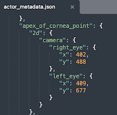

# DataLoader

This module provides an abstraction layer for Datagen dataset loading. It loads each of the images and the textual modalities. Whenever possible, a modality is converted to a Numpy array.
A dataset can be easily loaded using the following commands:

```
ds = Dataset(path='./Data')
```

A single datapoint can be accessed using:
```
dp = ds[0]
```

A modality can be accessed using:
```
rgb_img = dp.rgb_img
right_eye = dp.apex_of_cornea_point.key_2d.camera.right_eye
```
```
right_eye
Out[1]: array([402, 488])
```



<u>Important note<u>: Since Python doesn't allow for a digit to be a field name, '2d' and '3d' fields have been renamed to 'key_2d' and 'key_3d'

Each datapoint within the dataset is lazily loaded (it is loaded from disk only when accessed). <br><br>
<br>
Moreover, the datapoint format evolves frequently. We do our best to update the repository along with the format, but we can't guarantee that it is always up-to-date. <br>
Please provide any feedback you see fit, and let us know if something is broken.
<br><br>
Datagen CS team