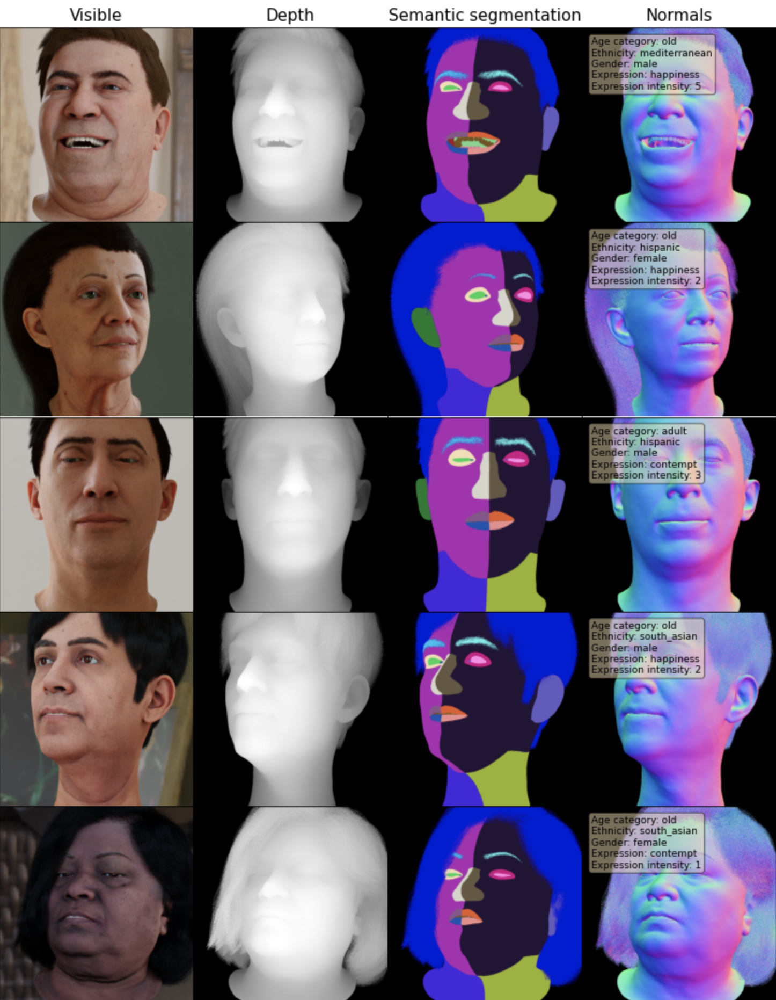

# dgutils

A set of Jupyter notebooks designed to help discover the Datagen dataset and its modalities <br>
Moreover, the notebooks give some guidance over common dataset manipulations.
<br><br>

## Installation steps
The notebook is based on the DataLoader submodule. <br>
Begin by cloning it:

```
git clone https://github.com/DatagenTech/dgutils.git
```

Create a new Conda environment with Python 3.9:
```
conda create --name dgutils python=3.9
conda activate dgutils
```

Install the requirements:
```
pip install datagen-tech
```


Please provide any feedback you see fit, and let us know if something is broken.
<br><br>
Datagen CS team


