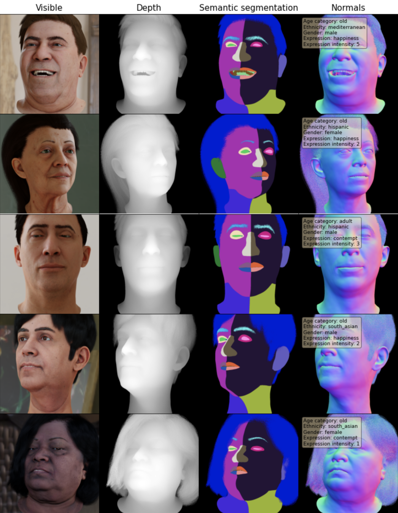
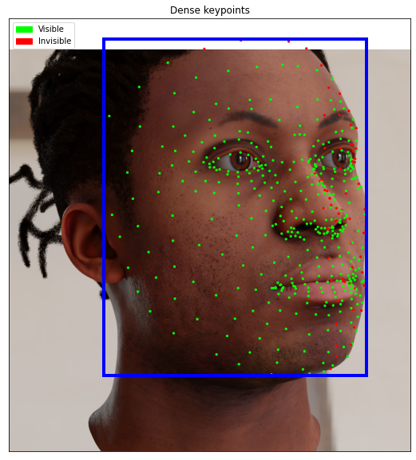

# dgutils

A set of Jupyter notebooks designed to help discover the Datagen dataset and its modalities <br>
Moreover, the notebooks give some guidance over common dataset manipulations.
<br><br>
The notebook is based on the DataLoader submodule. The proper way to clone the repository is:
```
git clone --recurse-submodules https://github.com/DatagenTech/dgutils.git
```
The recommended Python version is 3.9

Please provide any feedback you see fit, and let us know if something is broken.
<br><br>
Datagen CS team


