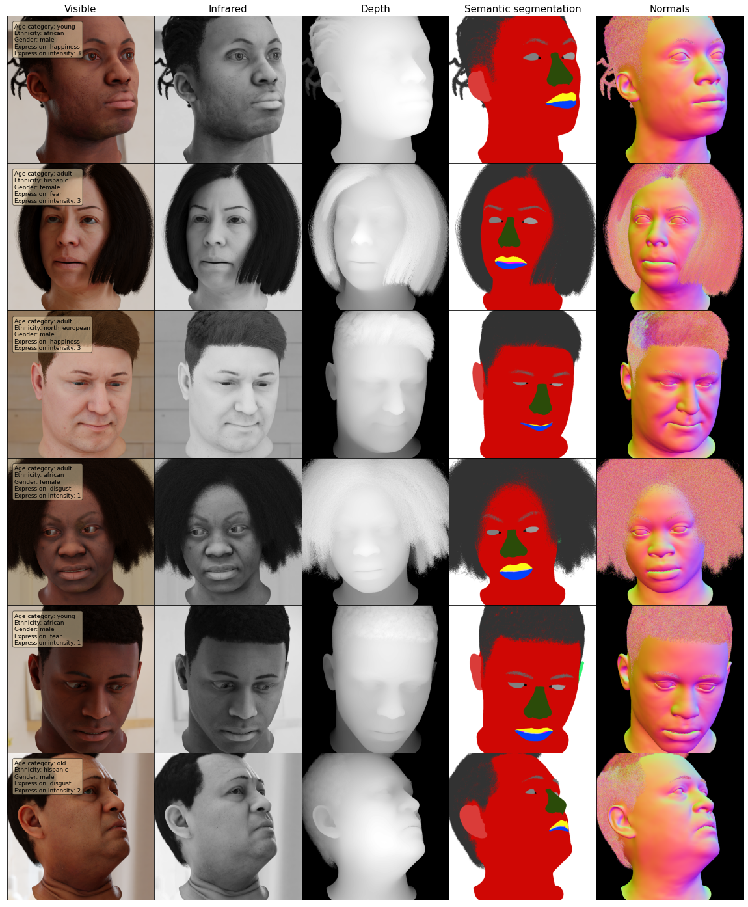
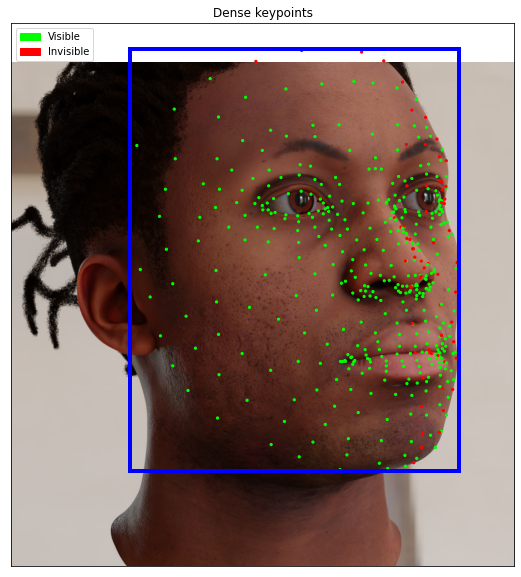

# dgutils

A set of Jupyter notebooks designed to help discover the Datagen dataset and its modalities  
Moreover, the notebooks give some guidance over common dataset manipulations.
  
Please provide any feedback you see fit, and let us know if something is broken.
  
Datagen CS team

